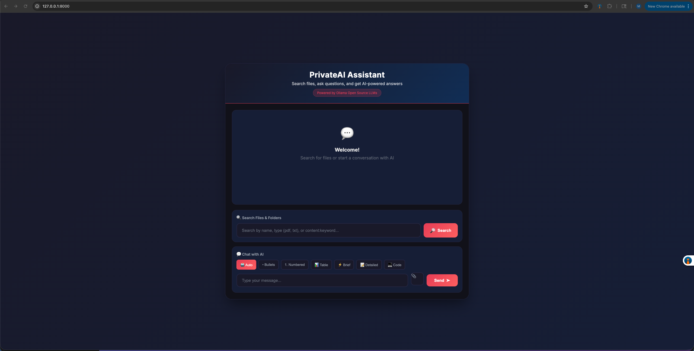

# PrivateAI Assistant

A private, local AI-powered chat application built with Django and Ollama. This application allows you to chat with an AI assistant, search files and folders on your Mac, and ask questions about documents. All processing happens locally - your data never leaves your machine.

## Screenshot



## Table of Contents

- [Features](#features)
- [Prerequisites](#prerequisites)
- [Installation](#installation)
- [Running the Application](#running-the-application)
- [Usage Guide](#usage-guide)
- [Project Structure](#project-structure)
- [API Endpoints](#api-endpoints)
- [Troubleshooting](#troubleshooting)

## Features

### AI Chat
- Chat with Mistral AI model running locally via Ollama
- All conversations are private and processed locally on your machine
- No data is sent to external servers

### Document Analysis
- Upload and analyze PDF documents
- Upload text files (.txt, .md, .py, .js, .html, .css, .json, .xml, .csv, etc.)
- Ask questions about uploaded documents
- Get AI-powered summaries and insights

### File and Folder Search
- Search for files and folders across your Mac using Spotlight integration
- Filter by file type (pdf, txt, doc, etc.)
- Search inside file contents using `content:keyword` syntax
- Browse directory contents
- Attach found files directly to chat

### Response Formatting
- Choose how the AI formats its responses:
  - **Auto**: AI decides the best format
  - **Bullets**: Response as bullet points
  - **Numbered**: Response as numbered list
  - **Table**: Response in table format
  - **Brief**: Short, concise answer (2-3 sentences)
  - **Detailed**: Comprehensive explanation with sections
  - **Code**: Technical response with code blocks
- Markdown rendering with syntax highlighting for code blocks

## Prerequisites

Before you begin, ensure you have the following installed:

1. **Python 3.10 or higher**
   ```bash
   python3 --version
   ```

2. **Ollama** - Local AI model runner
   - Download from: https://ollama.ai
   - After installation, pull the Mistral model:
   ```bash
   ollama pull mistral
   ```

3. **Git** (optional, for cloning the repository)

## Installation

### Step 1: Clone or Download the Repository

```bash
git clone <repository-url>
cd document_reader_ollama
```

Or download and extract the ZIP file.

### Step 2: Create a Virtual Environment

```bash
python3 -m venv .venv
```

### Step 3: Activate the Virtual Environment

On macOS/Linux:
```bash
source .venv/bin/activate
```

On Windows:
```bash
.venv\Scripts\activate
```

### Step 4: Install Dependencies

```bash
pip install django requests PyPDF2
```

### Step 5: Run Database Migrations

```bash
python manage.py migrate
```

## Running the Application

### Step 1: Start Ollama

Make sure Ollama is running. Open a terminal and run:
```bash
ollama serve
```

Or ensure the Ollama desktop application is running.

### Step 2: Verify Mistral Model

Check that the Mistral model is available:
```bash
ollama list
```

You should see `mistral` in the list. If not, pull it:
```bash
ollama pull mistral
```

### Step 3: Start the Django Server

In a new terminal, navigate to the project directory and run:
```bash
source .venv/bin/activate
python manage.py runserver
```

### Step 4: Open the Application

Open your web browser and navigate to:
```
http://127.0.0.1:8000
```

## Usage Guide

### Chatting with AI

1. Type your question in the "Chat with AI" input field
2. (Optional) Select a response format using the format buttons
3. Click "Send" or press Enter
4. The AI will respond with formatted text

### Uploading Documents

1. Click the attachment icon (paperclip) next to the input field
2. Select a file from your computer (PDF, TXT, or other text files)
3. The file name will appear below the input field
4. Type your question about the document
5. Click "Send" to get AI-powered answers about the document

### Searching Files and Folders

1. Use the "Search Files and Folders" section
2. Enter your search query:
   - Simple search: `report` (finds files with "report" in the name)
   - File type filter: `pdf` or `txt` (finds all files of that type)
   - Content search: `content:budget` (finds files containing "budget")
   - Combined: `report pdf` (finds PDF files with "report" in the name)
3. Click "Search"
4. Click on any result to:
   - Open a folder and browse its contents
   - Attach a file to your chat

### Response Format Options

Select a format button before sending your message:

| Format | Description |
|--------|-------------|
| Auto | AI chooses the best format automatically |
| Bullets | Unordered list with bullet points |
| Numbered | Ordered list with numbers |
| Table | Data presented in table format |
| Brief | Concise 2-3 sentence response |
| Detailed | Comprehensive explanation with headings |
| Code | Technical response with code blocks |

## Project Structure

```
document_reader_ollama/
├── chat/                    # Main application
│   ├── templates/
│   │   └── chat/
│   │       └── chat.html   # Frontend UI
│   ├── urls.py             # URL routing
│   └── views.py            # Backend logic and API endpoints
├── chatapp/                 # Django project settings
│   ├── settings.py
│   └── urls.py
├── manage.py               # Django management script
├── db.sqlite3              # SQLite database
└── README.md               # This file
```

## API Endpoints

| Endpoint | Method | Description |
|----------|--------|-------------|
| `/` | GET | Main chat interface |
| `/api/message/` | POST | Send chat message with optional file |
| `/api/search/` | POST | Search files and folders |
| `/api/fetch_file/` | POST | Fetch file content for attachment |
| `/api/list_dir/` | POST | List directory contents |
| `/api/read_file/` | POST | Read file content |

## Troubleshooting

### Ollama Connection Error

If you see "Ollama error" messages:

1. Verify Ollama is running:
   ```bash
   curl http://localhost:11434/api/tags
   ```

2. Restart Ollama:
   ```bash
   ollama serve
   ```

3. Check if the Mistral model is installed:
   ```bash
   ollama list
   ```

### Port Already in Use

If port 8000 is busy:

```bash
# Find and kill the process
lsof -ti:8000 | xargs kill -9

# Or run on a different port
python manage.py runserver 8080
```

### File Search Not Working

- Ensure Spotlight is enabled on your Mac (System Preferences > Spotlight)
- Grant terminal/IDE access to search your files if prompted
- Try searching in common directories first

### PDF Reading Issues

If PDF text extraction fails:
- Ensure the PDF contains actual text (not scanned images)
- Try a different PDF file
- Check that PyPDF2 is installed: `pip install PyPDF2`

## Technology Stack

- **Backend**: Django 6.0
- **AI Model**: Ollama with Mistral
- **PDF Processing**: PyPDF2
- **File Search**: macOS Spotlight (mdfind)
- **Frontend**: HTML, CSS, JavaScript
- **Markdown Rendering**: marked.js
- **Code Highlighting**: highlight.js

## Privacy

This application runs entirely on your local machine. No data is sent to external servers. All AI processing is done locally through Ollama.

## Author

Created by **Sree** - [GitHub](https://github.com/msreekanth02)

## License

See the LICENSE file for details.
